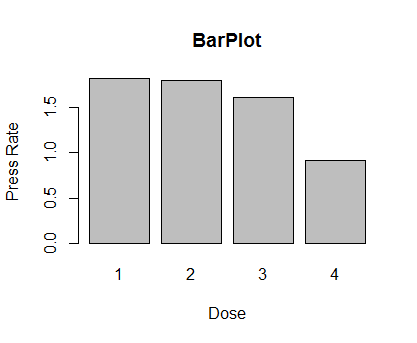
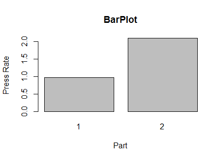
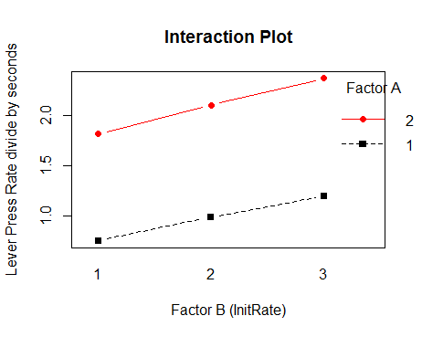

Drug Effect
=============================================
author: Lam Vu and Calvin Hsu
date: May 25, 2015
autosize: true
=========================================================================

## Lever press rate analysis regarding dosage level and reinforcement factor
### Dataset Name: Drug Effect Experiment

### Abstract:

This project used data provided by the drug effect experiment performed on the rats to find the different effects on rats lever press rate effects by the rats initial press, dosage level, and frequency schedule. Interested in how different dosage levels affected the behavior of the rats based on the total number of lever presses divided by elapsed time in seconds, we found that there was really no difference between the first 3 dosage levels. However, the total number of lever presses tended to be significantly lower for dosage level 4. Also, we wondered if when the rats received water also affected the behavior of rats. Our conclusion to the question of interest is that when the rats received water after the fifth lever press had more total number of lever presses than when the rats received water after the second lever press. We were also interested in comparing the changes of the group 1 and 3 press rate from study part 1 to part 2. And comparing which group had a larger change in the two parts of study. We found that for both group 1 and 3 the press rate was greater in part 2(FR-5) to part 1(FR-2). Also the changes of both groups were not significantly different from each other, neither of the groups increased substantially in part 2(FR-5) to part 1(FR-2).

### Problem and Motivation:

Our project revolves around the experiment of drug effects on the behavior of rats. The drug experiment considered the rat's behavior to press a lever to obtain water influenced by the initial press rate , drug, and frequency schedule. The experiment was done in two parts differentiated by the frequency schedule of receiving water after two or five presses on the lever. Each part tested on 12 male albino rats with approximately the same weight and given all four dosage of saline twice, proving two observation units per treatment. The dosage level were measured in terms of milligrams per kilogram of weight of the rat. We are motivated in using this data because the premise of the experiment and the reinforcement schedule factor was interesting to learn about. The reader should be interested too because he or she can see how different factors can affect the behavior of rats that were being studied on based on the total number of lever presses until a stable rate of pressing is reached by the rat. These factors can potentially be used in further medical research in order to increase the health of human beings by looking at the results given to us by the behavior of rats.

### Questions of Interest:

1.  Does dosage level decrease the total number of lever presses divided by elapsed time in seconds?
2.  Does receiving water each time after the fifth lever press increase the total number of lever presses divided by elapsed time in seconds compared to receiving water each time after the second lever press?
3.  Is there a difference in total number of lever presses divided by elapsed time in seconds for rats in initial lever press rate group 1 in part I of the study(FR-2) to part II of the study (FR-5)?
4.  Is there a difference in total number of lever presses divided by elapsed time in seconds for rats in initial lever press rate group 3 in part I of the study(FR-2) to part II of the study (FR-5) and compare that difference to group 1 to see which group had a greater change.

### Data:

Drug Effect Experiment.

### Variables included:

Identification number, part of study (reinforcement schedule FR-2,FR-5), rat identification, Initial lever press rate, dosage level (mg/kg), observation unit, response variable of lever press divided by elapsed time in seconds.

### Statistical Methods:

Question 1: In this question we used the one factor- ANOVA model with factors being Dosage. The response variable was PressRate. We then used multiple simultaneous comparison tests.

Question 2: In this question we used the one factor- ANOVA model with factors being Part. The response variable was PressRate. We then used comparison tests.

Question 3: We used the two factor- ANOVA model with factors being InitRate and Part. The response variable was PressRate. We then used multiple simultaneous comparison tests.

Question 4: In this question we used the two factor- ANOVA model with factors being InitRate and Part. The response variable was PressRate. We then used multiple simultaneous comparison tests.

### Statistical Analysis, Results and Interpretation:

### Question 1:

From the bar plot, we can see that the the means of the total number of lever presses divided by elapsed time in seconds decreases as the dosage level increase. But we can't be certain based on this bar plot. Therefore, we will use multiple simultaneous comparison tests. Using 95% confidence intervals, we will see if the dosage level decreases the total number of lever presses divided by elapsed time in seconds.

mu1 = true mean of the total number of lever presses divided by elapsed time in seconds for dosage level 1
mu2 = true mean of the total number of lever presses divided by elapsed time in seconds for dosage level 2
mu3 = true mean of the total number of lever presses divided by elapsed time in seconds for dosage level 3
mu4 = true mean of the total number of lever presses divided by elapsed time in seconds for dosage level 4
D1 = mu1-mu2
D2 = mu1-mu3
D3 = mu1-mu4
D4 = mu2-mu3
D5 = mu2-mu4
D6 = mu3-mu4

    ##              Df Sum Sq Mean Sq F value   Pr(>F)    
    ## dat$Dose      1  20.18  20.184   43.26 4.51e-10 ***
    ## Residuals   190  88.64   0.467                     
    ## ---
    ## Signif. codes:  0 '***' 0.001 '**' 0.01 '*' 0.05 '.' 0.1 ' ' 1

We use Bonferonni's multiplier over Tukey's and Scheffe's because it is more efficient; therefore the confidence intervals are smaller.
**D1 Confidence Interval:** (-0.2395428, 0.2716261) We are 95% confident that the true mean difference between dosage level 1 and dosage level 2 is in between -0.2395428 and 0.2716261. But since 0 is in the confidence interval, the difference is insignificant.
**D2 Confidence Interval:** (-0.0451678, 0.4660011) We are 95% confident that the true mean difference between dosage level 1 and dosage level 3 is in between -0.0451678 and 0.4660011. But since 0 is in the confidence interval, the difference is insignificant.
**D3 Confidence Interval:** (0.6462905, 1.157459) We are 95% confident that the true mean difference between dosage level 1 and dosage level 4 is in between 0.6462905 and 1.157459.
**D4 Confidence Interval:** (-0.06120946, 0.4499595) We are 95% confident that the true mean difference between dosage level 2 and dosage level 3 is in between -0.06120946 and 0.4499595. But since 0 is in the confidence interval, the difference is insignificant.
**D5 Confidence Interval:** (0.6302489, 1.141418) We are 95% confident that the true mean difference between dosage level 2 and dosage level 4 is in between 0.6302489 and 1.141418.
**D6 Confidence Interval:** (0.4358739, 0.9470428) We are 95% confident that the true mean difference between dosage level 3 and dosage level 4 is in between 0.4358739 and 0.9470428.

From the multiple simultaneous comparison tests, we are 95% confident that there is no difference between dosage levels 1 and 2, levels 1 and 3, and levels 2 and 3. We are also 95% confident that true mean difference of the total number of lever presses divided by elapsed time in second between dosage levels 1 and 4, levels 2 and 4, and levels 3 and 4 are positive, meaning that the true mean number of lever presses for dosage level 4 is less than the true mean number of lever presses for dosage levels 1, 2, and 3.
Our overall conclusion of whether dosage level decrease the total number of lever presses divided by elapsed time in seconds is that the dosage level does not decrease the total number of lever presses. We only found that the mean total number of lever presses divided by elapsed time in seconds for dosage level 4 is less than the mean total number of lever presses for the other dosage levels.

### Question 2:

From the bar plot, it seems that receiving water each time after the fifth lever press does increase the total number of lever presses divided by elapsed time in seconds compared to receiving water each time after the second lever press. But we can't be certain based on this bar plot. Therefore, we will use comparison tests. Using 95% confidence intervals, we will see if receiving water each time after the fifth lever press increase the total number of lever presses divided by elapsed time in seconds.

mu1 = true mean of the total number of lever presses divided by elapsed time in seconds for receiving water each time after the second lever press
mu2 = true mean of the total number of lever presses divided by elapsed time in seconds for receiving water each time after the fifth lever press
D1 = mu2-mu1

D1 Confidence Interval: (1.012971, 1.218279) We are 95% confident that the true mean difference of the total number of lever presses divided by elapsed time in seconds between receiving water each time after the fifth lever press and receiving water each time after the second lever press is in between 1.012971 and 1.218279. Since the confidence interval is positive, that means mu2 is greater than mu1. The total number of lever presses divided by elapsed time in seconds for receiving water each time after the fifth lever press is greater than the total number of lever presses divided by elapsed time in seconds for receiving water each time after the second lever press. Therefore we can say that receiving water each time after the fifth lever press does increase the total number of lever presses divided by elapsed time in seconds compared to receiving water each time after the second lever press.

Question 3 and 4:
-----------------

For questions 3 and 4 we first created an interaction plot and anova summary to see whether interaction effect and main effects were present. Then performed multiple comparison tests; comparing the press rate of initial group 1 in part 1 to part 2 of the study; comparing press rate of initial group 3 in part 1 to part 2 of the study; comparing the change of initial group 1 and 3 to each other to see which group increased more in the two parts of the study.

From the interaction plot we can see there is no interaction effect present because the curves are parallel, there is main effect of Factor A(Part) and Factor B(InitRate) present.

    ##                        Df Sum Sq Mean Sq F value   Pr(>F)    
    ## dat$InitRate            1   7.99    7.99  36.637 7.56e-09 ***
    ## dat$Part                1  59.74   59.74 273.938  < 2e-16 ***
    ## dat$InitRate:dat$Part   1   0.09    0.09   0.434    0.511    
    ## Residuals             188  41.00    0.22                     
    ## ---
    ## Signif. codes:  0 '***' 0.001 '**' 0.01 '*' 0.05 '.' 0.1 ' ' 1

**Null Hypothesis:** All (aB)ij = 0; there are no interaction effect
**Alternative Hypothesis:** Not all (aB)ij equal zero; there are interaction effect

F\* = 0.09/0.22 = 0.4090909 F(0.95,1,188) = 3.891398

**Decision rule:** If F\* &gt; 3.891398, then reject the null hypothesis meaning there are interaction effect at the significant level of 0.05
**Conclusion:** Since F\* = 0.4090909 which is less than 3.891398, we do not reject the null hypothesis and conclude that there is no interaction effect at significant level of 0.05 P-value = P(F(0.95,1,188) &gt; F\*) = 0.511 which is greater than alpha so we do not reject the null hypothesis and conclude there are no interaction effect.

**Null Hypothesis:** A1=...=Aa= 0, there are no main effect (Factor A is Part)
**Alternative Hypothesis:** not all Ai are 0; there are main effect

F\*= 59.74 /0.22 = 271.5455 F(0.95,1,188) = 3.891398

**Decision rule:** If F\* &gt; 3.891398, then reject the null hypothesis meaning there are main effect at the significant level of 0.05
**Conclusion:** Since F*= 271.5455 which is greater than 3.891398, we reject the null hypothesis and conclude that there are main effect present at the significant level of 0.05. P-value = P(F(0.99,1,16) &gt; F*) = &lt; 2e-16 which is less than alpha so we can reject the null hypothesis and say there is a main effect present.

**Null Hypothesis:** B1=...=Bb= 0, there are no main effect (Factor B is InitRate)
**Alternative Hypothesis:** not all Bi are 0; there are main effect

F\*= 7.99 /0.22 = 36.31818 F(0.95,1,188) = 3.891398

**Decision rule:** If F\* &gt; 3.891398, then reject the null hypothesis meaning there are main effect at the significant level of 0.05
**Conclusion:** Since F*= 36.31818 which is greater than 3.891398, we reject the null hypothesis and conclude that there are main effect present at the significant level of 0.05. P-value = P(F(0.99,1,16) &gt; F*) = 7.56e-09 which is less than alpha so we can reject the null hypothesis and say there is a main effect present.

g1p1 is the true mean press rate of initial group 1 in part 1(FR-2)
g1p2 is the true mean press rate of initial group 1 in part 2(FR-5)
g3p1 is the true mean press rate of initial group 3 in part 1(FR-2)
g3p2 is the true mean press rate of initial group 3 in part 2(FR-5)
D1 = g1p1-g1p2 ; compares the press rate of initial group 1 in part 1(FR-2) to part 2(FR-5)
D2=g3p1-g3p2 ; compares the press rate of initial group 3 in part 1(FR-2) to part 2(FR-5)
L1=D1-D2 ; compares the difference of changes D1 and D2 to see which initial group 1 and 3, had greater change in part 1 to part 2 of the study.

**Confidence interval of D1** is (-1.388932 , -0.7348179) at 95% confidence ; g1p1 &lt; g1p2 For initial group 1 the press rate in part 2 of the study is greater than part 1, which meant FR- 5 increased press rate compared to FR-2.
**Confidence interval of D2** is (-1.497682 , -0.8435679) at 95% confidence ; g3p1 &lt; g3p2 For initial group 3 the press rate in part 2 of the study is greater than part 1, which meant FR- 5 increased press rate compared to FR-2.
**Confidence interval of L1** is(-0.4577295 , 0.6752295) at 95% confidence; no real difference between D1 and D2 because it contains 0; which meant there is no significant difference in the changes of initial group 1 and 3 press rate in part 1 to part 2 of the study. From our previous anova summary we concluded there are no interaction effect between Part and InitRate and that the main effects of Part and InitRate are present. From these results we can conclude that for both initial rate group 1 and 3 the lever press rate increased in the second part of the study compared to the first meaning the frequency schedule (FR-5) caused the lever press rate to increase. The difference between the increase of group 1 and group 3 from the first part of the study (FR-2) to the second part of the study (FR-5) there was no difference in how much the lever press rate increased. This meant the frequency schedule factor affected the press rates of the rats, FR-5 cause rats to press the lever more frequently compared to FR-2 for initial group 1 and 3. However there are no substantial influence of frequency schedule on the change of press rate when comparing group 1 to group 3. The frequency schedule did not make one group press substantially more than another group; or that one group pressed much more when subjected to the frequency schedule 2 and 5.

### Criticisms and Possible Extensions:

Our analysis is most unlikely to be completely perfect, but overall our analysis is mostly based on our results in regards to our questions of interests. A criticism of our work is that we only used a level of significance of 0.05. All of our confidence intervals were only being 95% confident. If we increased our level of significance to 0.01 and all of our confidence intervals to being 99% confident, our results would be more accurate because we wouldn't be as easy to be making a type 1 error, which is rejecting the null hypothesis even though it is true. Before the p-value only needed to be smaller than 0.05, but making the significance level 0.01 means that the p-value has to be smaller than 0.01 in order to reject the null hypothesis. Also by using a 99% confidence interval, the confidence interval will be narrower, causing the interval to be more accurate. We based our project on the data provided by the drug experiment which was an experimental study with complete randomized design testing multiple factors. The premised of the study was appropriate and organized so we believe the data used in our project was valid. Another criticism of our work can be that we did single factor and two factor studies when there were three factors tested which each factor may have had influenced the response variable. We made sure that interaction effect did not exist when we made our comparison tests.

### Conclusions:

From our results, we found that there was really no difference between the first 3 dosage levels. However, the total number of lever presses tended to be significantly lower for dosage level 4. When the rats received water after the fifth lever press, they had more total number of lever presses than when the rats received water after the second lever press. We found that for both group 1 and 3 the press rate was greater in part 2(FR-5) to part 1(FR-2). Also the changes of both groups were not significantly different from each other, neither of the groups increased substantially in part 2(FR-5) to part 1(FR-2). Through the use of statistical methods we are able to analyze our data and answer the questions of interest. We are confident in our results because the methods we used were appropriate and efficient in finding the answers to the questions. Our results and interpretations were clear and concise in answer the questions of interest. These results can be applied to further studies regarding drug dosage and frequency schedule.

------------------------------------------------------------------------
