author: Lam Vu


# Non-Parametric Statistics Project


###Analysis of Sample 1:
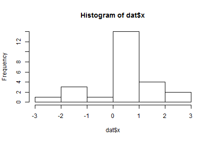
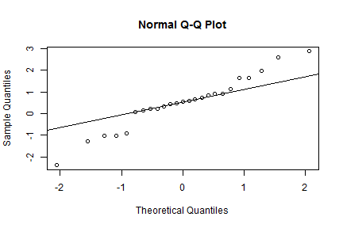

From these diagnostic plots I conclude that the data from sample 1 is not normally distributed and is skewed to the left. Since the data seems to violate the assumption of normality I decided to use nonparametric methods.

Since sample 1 contains only one sample, I will use a one-sample method. The nonparametric tests I can use are the central limit theorem (CLT) test and the binomial test. Binomial test will generally have a higher power than the CLT test for heavier-tailed population distribution in which for this case seems to apply. I decided to use a binomial test which seems the most appropriate  for sample 1 to test whether the mean is greater than 0. 
Ho:mu = 0 
HA: mu > 0

Exact binomial test
data:  x and n
number of successes = 20, number of trials =25, p-value = 0.002039
alternative hypothesis: true probability of success is greater than 0.5
95 percent confidence interval: 0.6245949 1.0000000
sample estimates: probability of success  0.8 

From the test I obtained a p-value smaller than alpha= 0.05, so I reject the null hypothesis and conclude that mu> 0.

##Analysis of Sample 2:
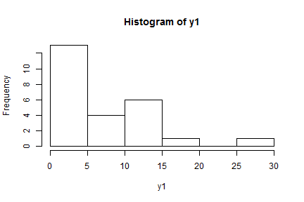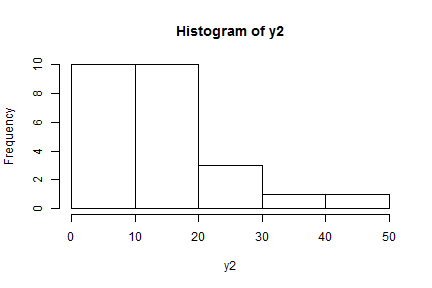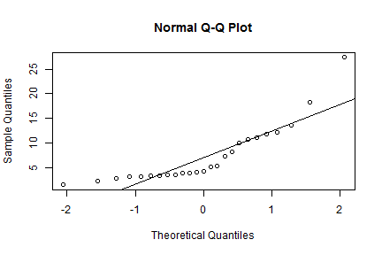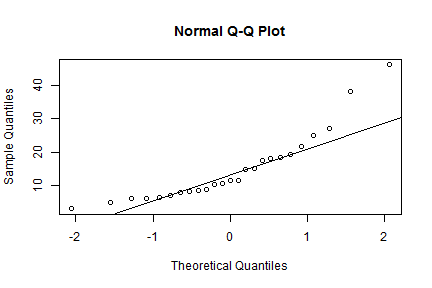


Both dataset in sample 2 do not look normally distribution which violated the normality assumption, I decided to use nonparametric methods. Since sample 2 contains two sample I will use a two sample method. Since the data are paired I assume are chosen randomly and independently and came from the same population. Using the  Wilcoxon Rank Sum Test, I assume that no two observations are the same and the ranks are distinct. 

I decided to use a Wilcoxon Rank Sum Test for sample 2 in testing whether the true mean 
of mu1 < mu2.

H0: mu1 = mu2  
HA: mu1 < mu2


I compared the result  of the Wilcoxon Rank Sum Test to a two-sample t-test.


```
## 
## 	Exact Wilcoxon rank sum test
## 
## data:  dat$y1 and dat$y2
## W = 144, p-value = 0.0004023
## alternative hypothesis: true mu is less than 0
```

```
## 
## 	Welch Two Sample t-test
## 
## data:  dat$y1 and dat$y2
## t = -3.1584, df = 38.338, p-value = 0.001545
## alternative hypothesis: true difference in means is less than 0
## 95 percent confidence interval:
##       -Inf -3.551657
## sample estimates:
## mean of x mean of y 
##    7.3716   14.9880
```

Both test gave me the same conclusion to reject the null hypothesis and conclude that 1 < 2 . The Wilcoxon Rank Sum-Test gave me a lower p-value than the two-sample t-test. Since the Wilcoxon Rank Sum-Test is a nonparametric test the probability of Type 1 error is not dependent upon the form of the distribution but requires that the two distributions be identical under the assumption of no treatment effect. Observations that are unusually large or small in comparison with the data can have adverse effect on the power of the t-test but will have less of an effect on tests based on ranks. A t-test will have a greater power than the Wilcoxon test for small sample and for distributions that are light tailed however that is not the case with the data in sample 2.

For sample 2 in testing if the variances differ, I had the choice of using a Siegel-Tukey or an Ansari-Bradley test but I decided to use the latter because the Ansari-Bradley test overcomes the ambiguity of Siegel-Tukey since it averages the ranks obtained by doing the Siegel-Tukey ranking both ways instead of one way.
I decided to use an Ansari-Bradley Test for sample 2 in testing if the variances are different. 

H0: 1 = 2  
HA: 1 != 2

```
## 
## 	Ansari-Bradley test
## 
## data:  y1 and y2
## AB = 299, p-value = 0.3126
## alternative hypothesis: true ratio of scales is not equal to 1
```

I compared the result  of the Ansari-Bradley Test to a F-test for equality of variances.

```
## 
## 	F test to compare two variances
## 
## data:  y1 and y2
## F = 0.33154, num df = 24, denom df = 24, p-value = 0.008969
## alternative hypothesis: true ratio of variances is not equal to 1
## 95 percent confidence interval:
##  0.1461015 0.7523671
## sample estimates:
## ratio of variances 
##          0.3315448
```

From the F test using alpha=0.05 I obtained a p-value less than alpha, so I conclude to reject the null hypothesis and state the variances of both sample are not equal, 1 != 2 .
From the Ansari-Bradley test I received that the true ratio of scales is not equal to 1 which I can conclude to reject the null hypothesis and state the variances of both sample are not equal,
sigma1 != sigma2 .
Both tests conclude to reject the null
hypothesis and that the variances of both sample are not equal, sigma1 != sigma2 .

For sample 2 in testing the cumulative distribution function (cdf) of F1(x) < F2 (x), I first used a Kolmogorov-Smirnov Test to see if the distribution differs then I plotted them the cdf of both dataset.

H0: F1(x) = F2(x)  
HA: F1(x) < F2(x)

Two-sample Kolmogorov-Smirnov test
data:  y1 and y2  
D^- = 0, p-value = 1  
alternative hypothesis: the CDF of x lies below that of y


a     0.10  0.05  0.025  0.01  0.005  0.001  
c(a)  1.22  1.36  1.48   1.63  1.73   1.95 


Decision Rule: Reject the null hypothesis if, 
D > c(a)sqrt((n1 + n2)/(n1*n2))
Using alpha = 0.05, the critical value would be 6.805438 which is greater than 0, so I conclude to not reject the null hypothesis and state that the two samples were drawn from the same continuous distribution. 

I then produced a plot of the cumulative distribution function of both data. The green(bottom) and blue lines(top) each correspond to an empirical distribution function, and the red dotted line is the two-sample KS statistic.

```
## 
## 	Two-sample Kolmogorov-Smirnov test
## 
## data:  y1 and y2
## D^- = 0, p-value = 1
## alternative hypothesis: the CDF of x lies below that of y
```

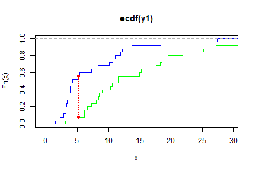


###Analysis of Sample 3:
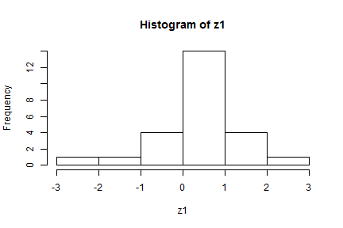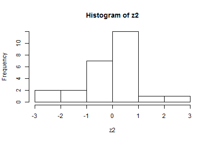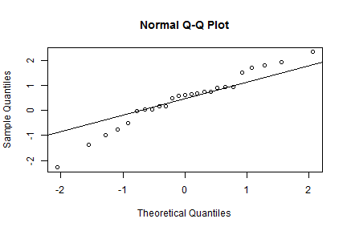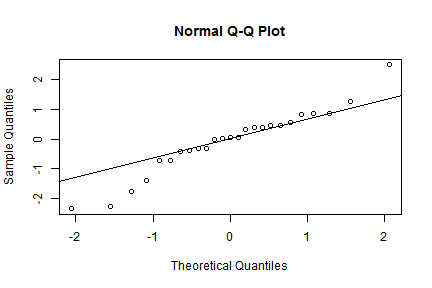
From the histogram and normal probability plot of sample 3 both dataset seems to violate the assumption of normality thus I will use a nonparametric method.
For sample 3 to compared the distributions I will using the Kolmogorov-Smirnov Test

Two-sample Kolmogorov-Smirnov test
data:  z1 and z2  
D = 0.36, p-value = 0.07832  
alternative hypothesis: two-sided  
Decision Rule: Reject the null hypothesis if,
D > c(a)sqrt((n1 + n2)/(n1*n2))

a     0.10  0.05  0.025  0.01  0.005  0.001  
c(a)  1.22  1.36  1.48   1.63  1.73   1.95 

Using alpha=0.05, the critical value would be 6.805438 which is greater than 0.36, so I conclude to not reject the null hypothesis and state that the samples are drawn from the same distribution. 


###Analysis of Sample 4:
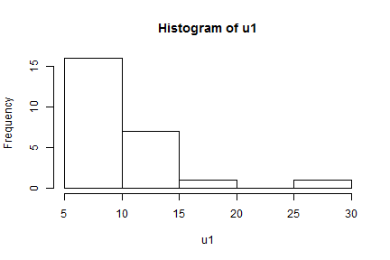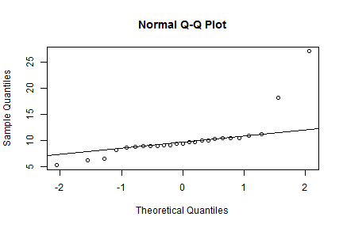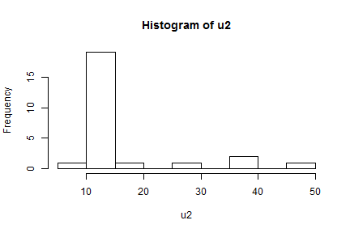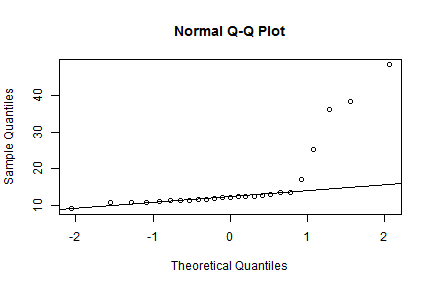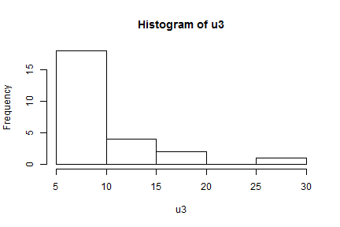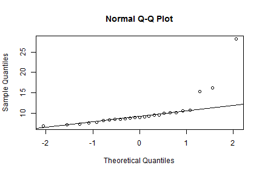

From these plots which indicated the datasets from sample 4 violated the assumptions of normality, thus I decided to use nonparametric methods.

Since there are greater than two samples in sample 4 I will use a K-sample method, however I have the choice of performing multiple pairwise comparison tests using two-sample test like the Wilcoxon rank sum test but this will have an adverse effect when for large k number of treatments because the probability of declaring two treatments to be different may be considerably greater than 5% even if all the treatments are the same. When k is large, it is certain we will find at least one statistically significant difference just by chance. I can also decide to use a Kruskal-Wallis Test which for data with outliers, a population distribution with heavy tails, or a population distribution significantly skewed, the Kruskal-Wallis Test will generally have a greater power to detect differences among treatment than a one way analysis of variance F Test.  

For sample 4 after looking at the plots above, these dataset seems to contain outliers and skewed population distribution so I decided used a Kruskal-Wallis Test to see if all the means are equal.   

H0: 1 = 2 = 3  
HA: Not all means are equal


```
## 
## 	Kruskal-Wallis rank sum test
## 
## data:  list(u1, u2, u3)
## Kruskal-Wallis chi-squared = 31.281, df = 2, p-value = 1.612e-07
```

I compared the results from the Kruskal-Wallis test to a F-test from ANOVA.

```
##             Df Sum Sq Mean Sq F value  Pr(>F)   
## type         2    595  297.46   6.572 0.00239 **
## Residuals   72   3259   45.26                   
## ---
## Signif. codes:  0 '***' 0.001 '**' 0.01 '*' 0.05 '.' 0.1 ' ' 1
```
From both test the p-value obtained is smaller than alpha=0.05, I conclude to reject the null hypothesis and state that not all the means are equal. The p-value I obtained from the Kruskal-Wallis Test is smaller than the F-test from ANOVA. The Kruskal-Wallis statistic will generally have a greater power to detect differences among treatments than the one-way analysis of variance F-test when the data has outlier, if the population distributions have heavy tails or it the population distributions are significantly skewed.


